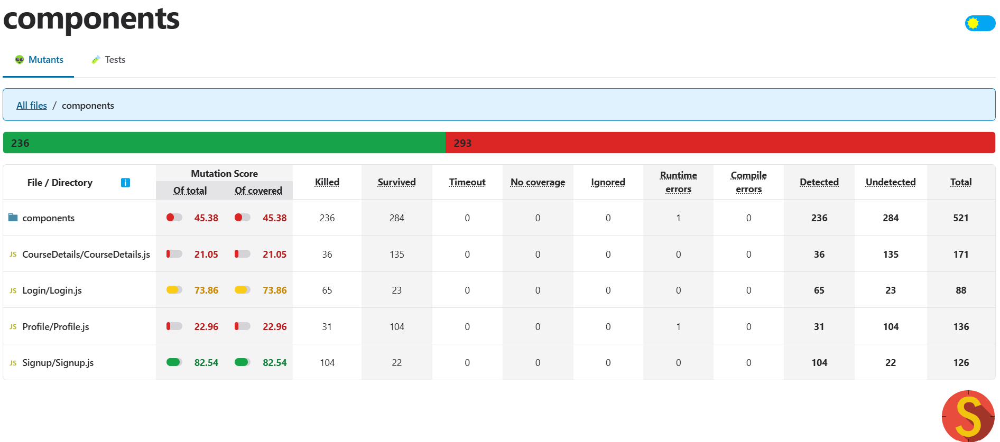

# ERP Portal: Faculty Registration Module

## Project Overview
This project implements a module for an ERP portal focusing on faculty registration and course management. The module includes:
- Login/Signup functionality
- Profile editing
- Course addition, deletion, and updates

The purpose of this project is to test the client-side code by designing test cases that bypass validation and perform mutation testing.

The project is developed using **React** (client-side), **Node.js** (server-side), and **MySQL** (database).

## Key Features
1. **Client-Side Validation**: Tested for bypass vulnerabilities.
2. **Mutation Testing**: Integrated Stryker to evaluate robustness.

## Test Strategy
**Bypass Testing**:
- Designed test cases that directly manipulate form inputs or script data to bypass client-side validation.
- Sent altered/corrupt data to the server.

**Tools Used**:
- **Stryker**: Mutation testing tool.
- Browser dev tools for form/script manipulation.

## How to Run
1. Clone the repository: [Repository Link]
2. Navigate to the project folder and install dependencies using:
   ```bash
   npm install
   ```
3. Set up the MySQL database using the provided SQL scripts. Update the database connection details in the backend configuration.
4. Start the server:
   ```bash
   npm start
   ```
5. Use `npm test` to execute the test cases.

## Results
- **Mutation Testing Score**: 85% mutation coverage.
- **Screenshots**:  
  


## Team Contributions
| Team Member                          | Contribution                                           |
|--------------------------------------|-----------------------------------------------------------|
| Chitransh Kulshrestha MT2023047      | Edit Profile, Updating, Deleting, and Adding new courses with test cases    |
| Gramya Gupta MT2023047               | Functionality of Login and Signup with test cases|


