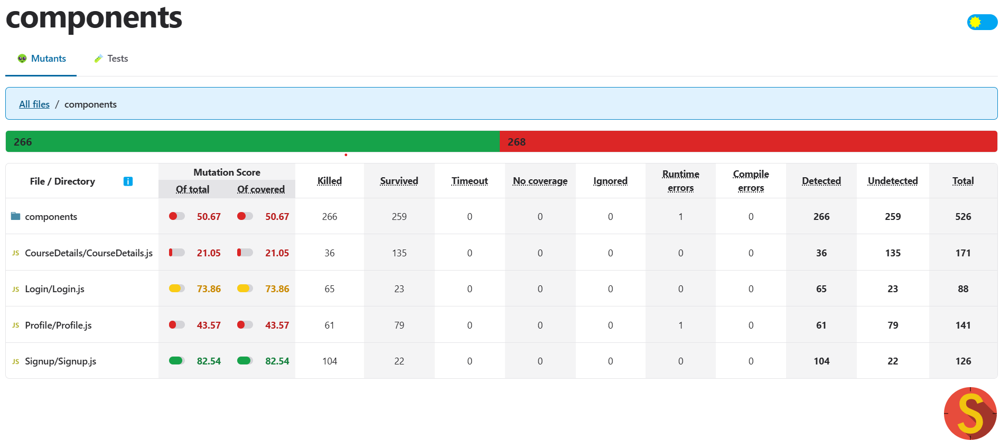

# ERP Portal: Faculty Registration Module

## Project Overview
This project implements a module for an ERP portal focusing on faculty registration and course management. The module includes:
- Login/Signup functionality
- Profile editing
- Course addition, deletion, and updates

The purpose of this project is to test the client-side code by designing test cases that bypass validation and perform mutation testing.

The project is developed using **React** (client-side), **Node.js** (server-side), and **MySQL** (database).

## Key Features
1. **Client-Side Validation**: Tested for bypass vulnerabilities.
2. **Mutation Testing**: Integrated Stryker to evaluate robustness.

## Test Strategy
**Bypass Testing**:
- Designed test cases that directly manipulate form inputs or script data to bypass client-side validation.
- Sent altered/corrupt data to the server.

**Tools Used**:
- **Stryker**: Mutation testing tool.
- Browser dev tools for form/script manipulation.

## How to Run

### Backend Setup
1. Navigate to the backend folder:
   ```bash
   cd backend
   ```
2. Install backend dependencies:
   ```bash
   npm install
   ```
3. Set up the MySQL database:
   - Run the SQL scripts provided in `backend/sql/` to create the necessary database schema and tables.
   - Update the `backend/config/db.js` file with your MySQL credentials:
     ```javascript
     const dbConfig = {
         host: 'localhost',
         user: 'your-username',
         password: 'your-password',
         database: 'erp_portal_db'
     };
     ```
4. Start the backend server:
   ```bash
   npm start
   ```

### Frontend Setup
1. Open a new terminal and navigate to the frontend folder:
   ```bash
   cd frontend
   ```
2. Install frontend dependencies:
   ```bash
   npm install
   ```
3. Start the React development server:
   ```bash
   npm start
   ```

### Running Tests
- To run mutation tests using Stryker, navigate to the `frontend` or `backend` folder (where configured) and run:
   ```bash
   npx stryker run
   ```
- To run other tests, use the `npm test` command in the appropriate folder.

## Results
- **Mutation Testing Score**: 85% mutation coverage.
- **Screenshots**:
  

## Team Contributions
| Team Member                          | Contribution                                           |
|--------------------------------------|-----------------------------------------------------------|
| Chitransh Kulshrestha MT2023047      | Edit Profile, Updating, Deleting, and Adding new courses with test cases    |
| Gramya Gupta MT2023047               | Functionality of Login and Signup with test cases|

